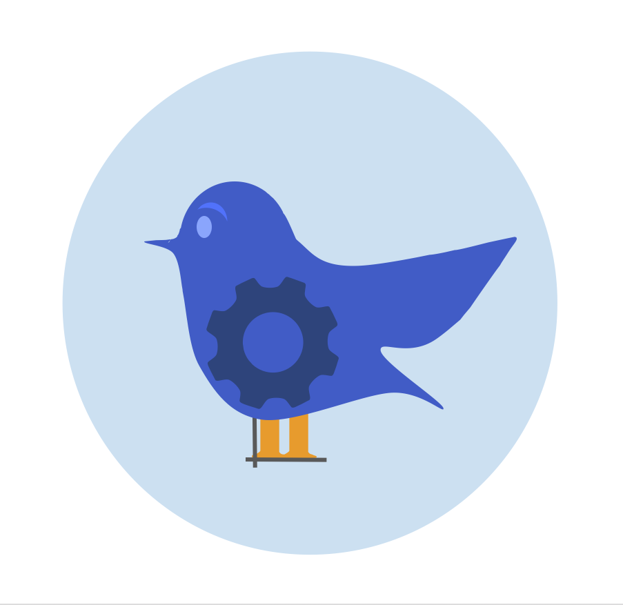
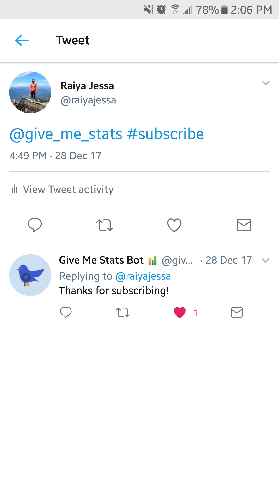
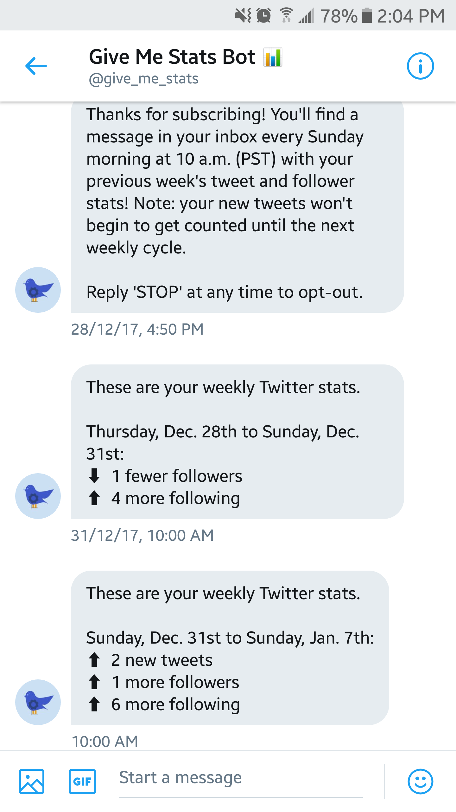

# [Give Me Stats Bot](https://twitter.com/give_me_stats)



Using the [Twitter API](https://developer.twitter.com/en/docs), [twit](https://github.com/ttezel/twit) and [node-cron](https://github.com/kelektiv/node-cron), this bot receives new subscribers, then begins to listen for their incoming tweets and send them ongoing direct messages that summarize their recent Twitter activity.

## Features

* __Streams incoming events.__ Adds users when they tweet the bot with _#subscribe_, and drops users when they tweet the bot with _#stop_ or send it a DM saying _STOP_.
* __Interacts with users.__ Sends new subscribers a thank-you reply and welcome message.
* __Sends scheduled activity reports.__ Each Sunday at 10:00 a.m. PST, sends each subscriber a DM summarizing changes in their number of tweets, followers and friends since the last message was sent.
* __Counts subscribers' tweets.__ Since the Twitter API offers no easy access to the number of tweets a user has posted, the bot also streams subscribers' tweets, incrementing a counter when one comes in. However, the stream's track list doesn't update automatically as subscribers are added, so the bot undergoes a scheduled refresh every Sunday at 10:01 a.m. PST (this means it won't count new subscribers' tweets until the next weekly cycle starts).
  * __Flaws:__ New subscribers' tweets posted between 10:00 and 10:01 a.m. are missed, and the stream must briefly close before it can refresh.

 

## Setup

__Twitter__

Login to your [Twitter](https://twitter.com/) account (the bot will tweet from this account, so you may want to create a new one). Create an `.env` file and add your twitter handle (lowercase, without the '@'):
```
TWITTER_HANDLE=<your_twitter_handle>
```

[Create a new app](https://apps.twitter.com/app/new). Under the _Keys and Access Tokens_ tab, you'll find your _Consumer Key_ and _Consumer Secret_. Modify the app's permission level to _Read, write and direct messages_, then re-generate them and scroll down to generate your access tokens. Add all four keys to your `.env` file:
```
TWITTER_CONSUMER_KEY=<YOUR_CONSUMER_KEY>
TWITTER_CONSUMER_SECRET=<YOUR_CONSUMER_SECRET>
TWITTER_ACCESS_TOKEN=<YOUR_ACCESS_TOKEN>
TWITTER_ACCESS_TOKEN_SECRET=<YOUR_ACCESS_TOKEN_SECRET>
```

__mLab__

Login to your (free) [mLab](https://mlab.com/) account. [Create a new MongoDB Deployment](https://mlab.com/create/wizard#PlanType-Provider), using _Amazon Web Services_ as your cloud provider and _Sandbox_ as your plan type. Select the AWS region closest to you.

Add a user to your new database under the _Users_ tab, with _read-only_ set to _false_. At the top of the page is a link to connect via the MongoDB URI: `mongodb://<dbuser>:<dbpassword>@ds...`. Add this to your `.env` file (inserting the username and password of the user you just created), along with the name of your database:
```
MONGODB_DATABASE_NAME=<your_database_name>
MONGODB_URI=<your_mongodb_uri>
```

__Then, install dependencies and start the bot:__
```
$ npm install
$ npm start
```
