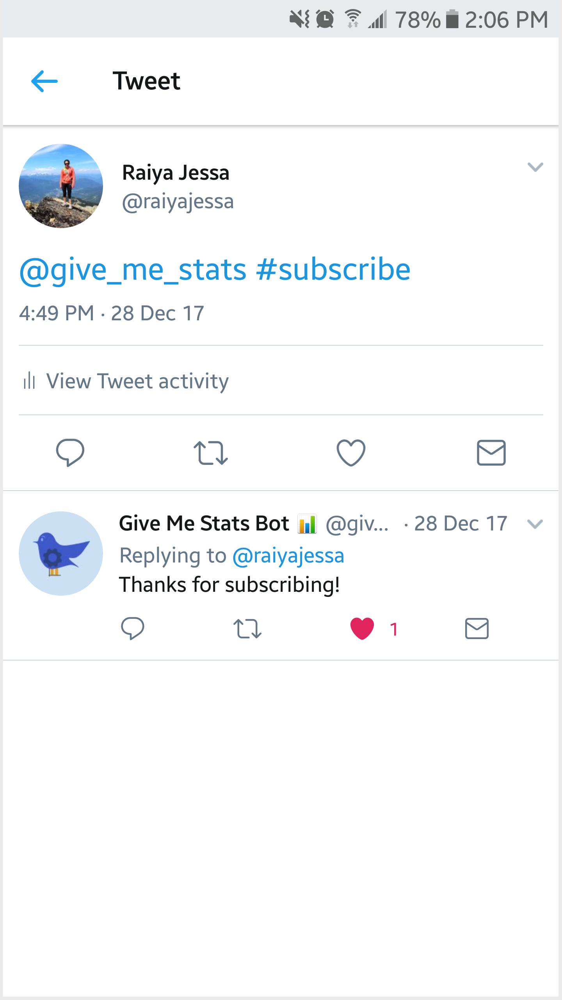
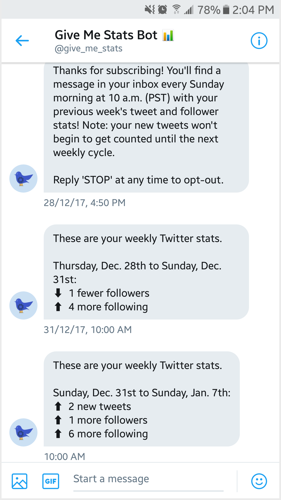

# give me stats bot

Using [twit](https://github.com/ttezel/twit), this bot receives subscribers and begins to listen for their tweets and send ongoing messages about their recent Twitter activity. _Note_: due to endpoint deprecations in the Twitter API, this project is no longer being maintained.

 

### Run the bot

Create an `.env` file with your [Twitter app](https://apps.twitter.com/app/new) and [MongoDB deployment](https://mlab.com/) secrets:
```
TWITTER_HANDLE=
TWITTER_CONSUMER_KEY=
TWITTER_CONSUMER_SECRET=
TWITTER_ACCESS_TOKEN=
TWITTER_ACCESS_TOKEN_SECRET=
MONGODB_DATABASE_NAME=
MONGODB_URI=
```
Then, install dependencies and start the bot: `$ npm install` and `$ npm start`
